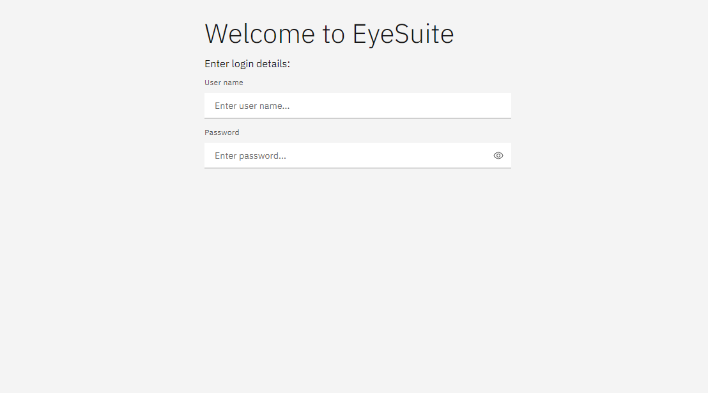
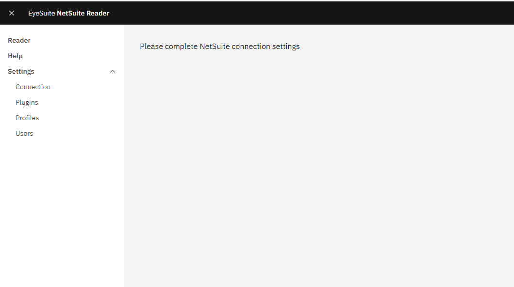
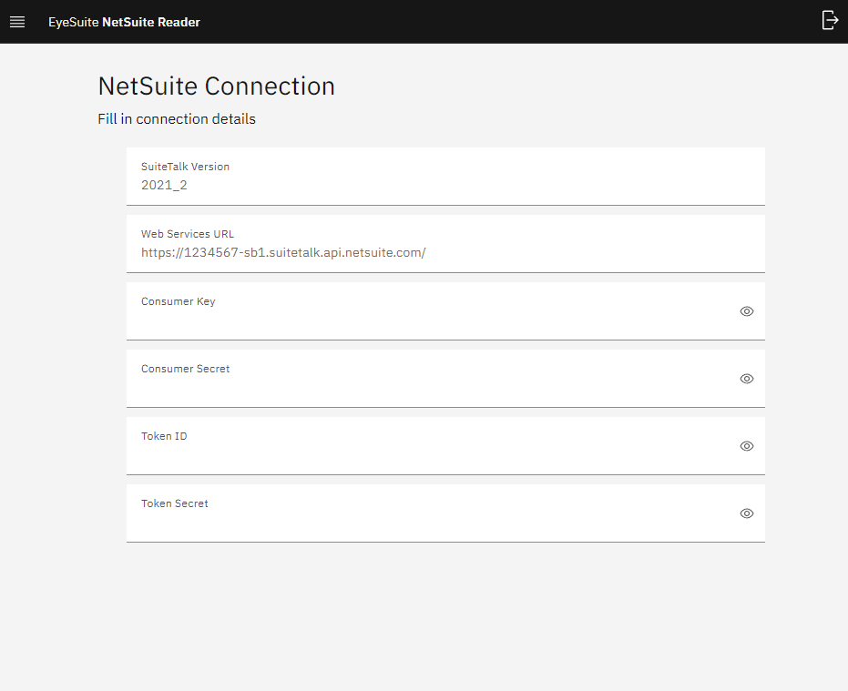
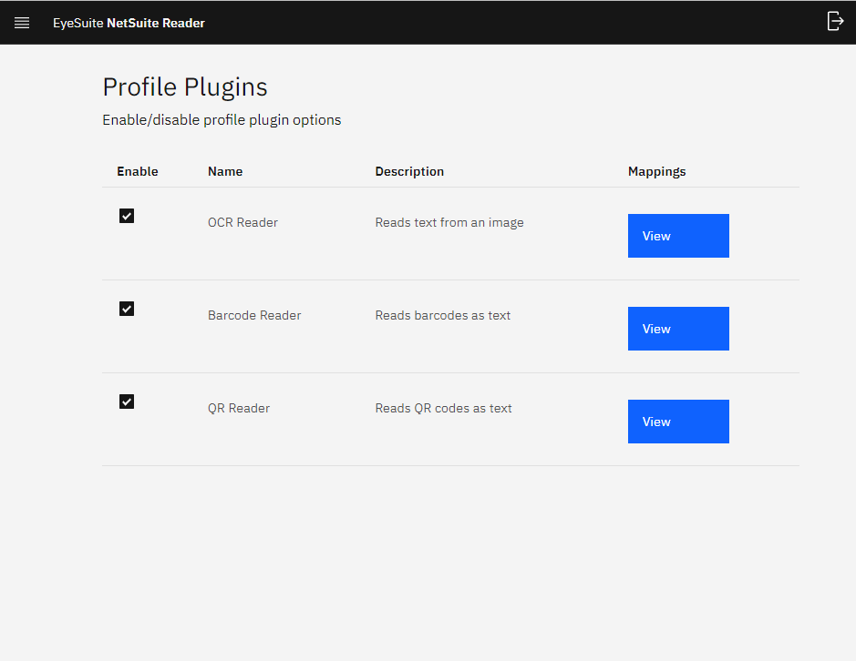
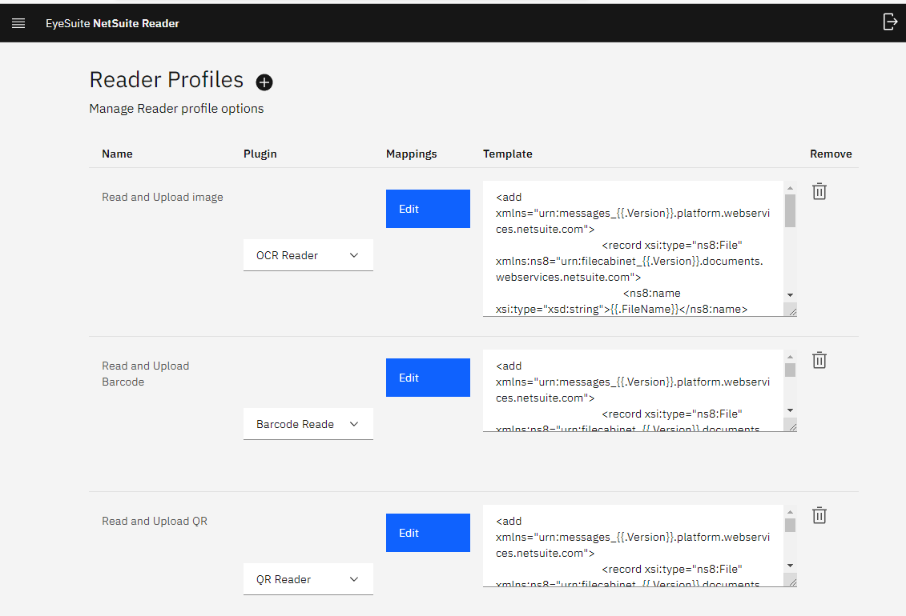
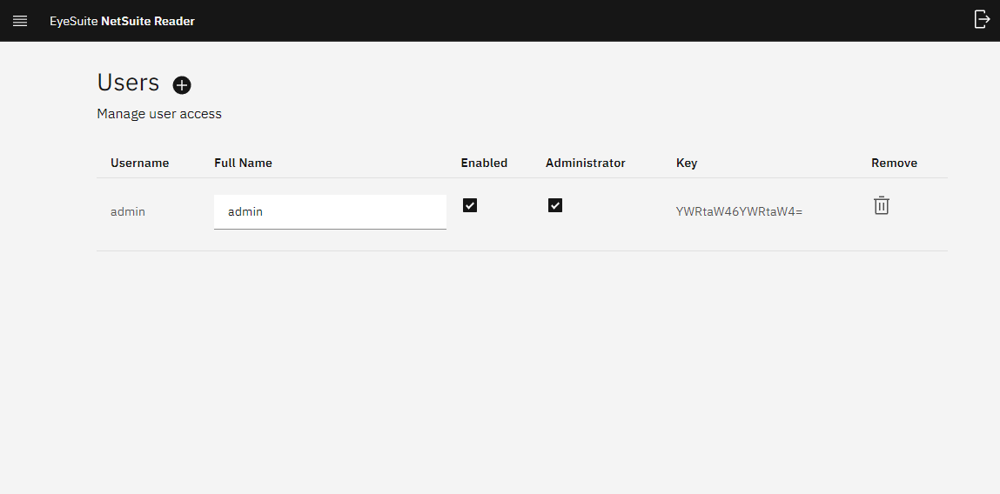
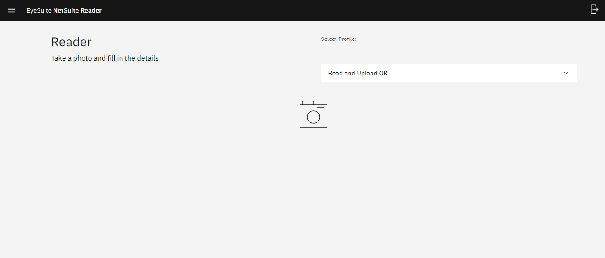
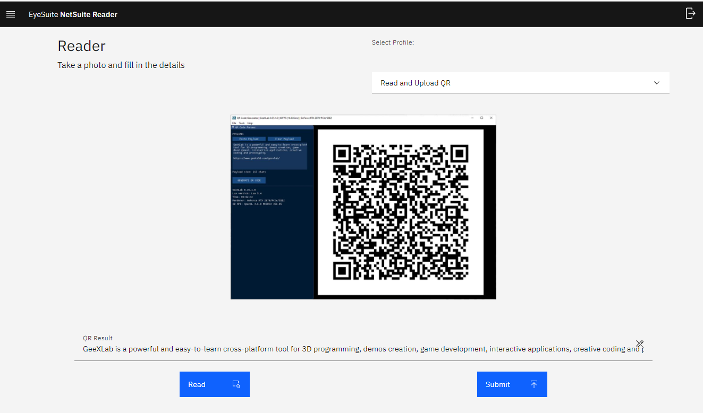

# EyeSuite

Image recognition server for NetSuite

## Getting started

1) Create the following docker-compose.yml file

```
version: '3'
services:

  # Redis DB
  db:
    container_name: eyesuite_redis
    image: redis:latest
    volumes:
      - data:/data
    restart: always

  # OCR server
  server:
    container_name: eyesuite
    image: hardcake/eyesuite:latest
    ports:
      - "8080:8080"
    depends_on:
      - db
    restart: always

volumes:
  data:
```

2) Run `docker-compose up --detach`

3) Wait a few minutes for the app to build/start

4) Go to http://localhost:8080

## Usage

### Login:

Login using admin:admin



### Configuration:

You'll be shown the intro screen



## Connection:
- Settings > Connection

Connection is where you enter the NetSuite endpoint and token info. 
This is used to communicate with SuiteTalk.



### Plugins:

- Settings > Plugins

Plugins are custom image readers which you can activate/deactivate on profiles



### Profiles:

- Settings > Profiles

Inside Profiles, you can configure:
- Which plugin to use to process image reading
- Field mappings to add extra information
- Template used to post data to NetSuite, you can add extra field data here inside double brackets `{{}}`

** Template variables starting with an uppercase letter are handled by the server, so they shouldn't be removed ** 



### Users:

- Settings > Users

Create or edit users, and enable access. Passwords are encoded so only the user knows it.




### Reader:

- Reader
- 
How to use the image reader?


Select a profile from the dropdown



Select an image to process


Click the Read button to process the image



Click the Submit to post image and field data to NetSuite

## License

MPL-2.0